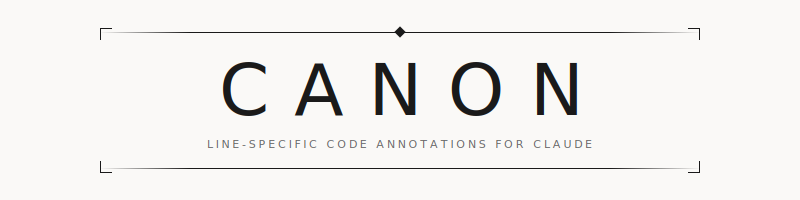

<p align="center">
  <picture>
    <source media="(prefers-color-scheme: dark)" srcset="assets/banner-dark.svg">
    
  </picture>
</p>

<p align="center">
  A browser-based annotation tool for Claude Code that lets you add<br>
  line-specific feedback to any file, with annotations flowing back<br>
  into your conversation as structured context.
</p>

---

## Install

Install the plugin from the [claude-plugins](https://github.com/deviantony/claude-plugins) marketplace:

```bash
claude plugin marketplace add deviantony/claude-plugins
claude plugin install canon@deviantony-plugins
```

Then in a Claude Code session, run `/canon:setup` to download the binary for your platform.

**Supported platforms:** Linux (x64, arm64), macOS (Apple Silicon), Windows (x64)

## Usage

In a Claude Code session:

```
/canon:new
```

A browser window opens automatically at `http://localhost:9847`. Browse files, click lines to annotate, and submit to return feedback to Claude.

### Update

To update Canon, update the marketplace and plugin:

```bash
claude plugin marketplace update deviantony-plugins
claude plugin update canon@deviantony-plugins
```

Then in a Claude Code session, run `/canon:setup` to update the binary.

Restart Claude Code after updating to ensure changes take effect.

### Custom Install Location

To install the binary to a custom location instead of `~/.local/bin`:

```bash
export CANON_BIN_DIR=/usr/local/bin
```

Then run `/canon:setup`.

### Container/Remote

If running Claude Code in a container or over SSH:

```bash
export CANON_PORT=9000
export CANON_REMOTE=1
claude  # then run /canon:new and open the URL manually
```
